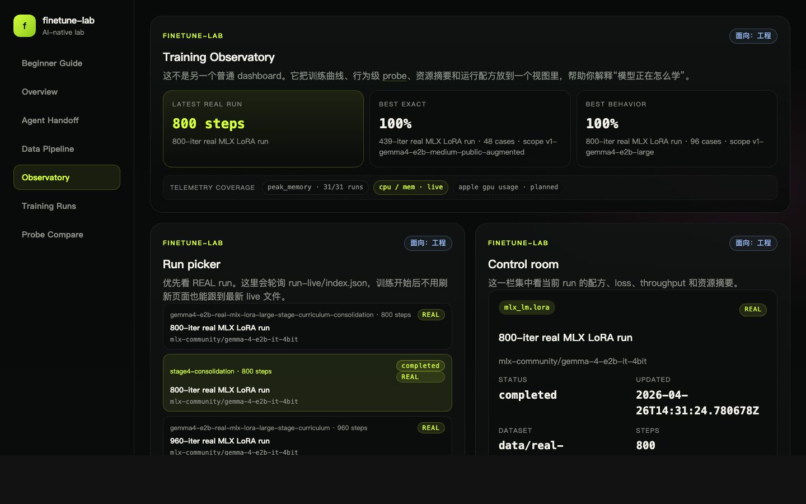

<div align="center">

# finetune-lab

**微调第一次看懂：不要只盯 loss 曲线，要看模型行为有没有真的改变。**
**SFT 数据 → LoRA 微调 → held-out probe → case diff → Web 实验课。**

[](https://github.com/xianfeng92/finetune-lab/actions/workflows/pages.yml)
[](https://xianfeng92.github.io/finetune-lab/)
[](https://github.com/ml-explore/mlx)
[](#ai-native交给-codex--claude-接手)
[](LICENSE)

🌐 **在线 demo：** https://xianfeng92.github.io/finetune-lab/

[](https://xianfeng92.github.io/finetune-lab/)

**训练 loss 降了，不代表模型学会。**
`finetune-lab` 会把训练结果放回 held-out probe 和 case-level diff 里看：模型到底有没有选对工具、填对参数、输出合法 JSON、做出正确行为。

</div>

---

## 这个仓库解决什么

模型微调的入门资料常常分成两类：要么只讲概念（"什么是 LoRA / SFT"），要么只贴脚本（"跑这条命令"）。真正让新手卡住的是中间这步：

> 我把训练跑完了，loss 也降了，模型到底学到了什么？

`finetune-lab` 把这个问题做成一条可跑、可看、可解释的学习链路：

1. **生成 SFT 数据** —— 单工具 / 多工具 / curriculum / preference pairs 都现成
2. **本地真实微调** —— Apple Silicon 上的 `mlx-lm.lora`，几十到几百 step 的真小规模 run
3. **held-out probe** —— 拿没参与训练的样本去测，看模型有没有真的泛化
4. **case diff 可视化** —— 同屏看 input / expected / actual，定位模型到底哪里学会、哪里没学会

整条链路的入口是 `make`：[ai-onboarding](#quick-start--60-秒上手) 探仓库、`ai-setup` 装依赖、`ai-lab` 把最小教学闭环跑一遍。你也可以先看 [在线 demo](https://xianfeng92.github.io/finetune-lab/)，不用安装任何依赖。

---

## Highlights

- 🎓 **微调第一次看懂** — 从一条 SFT 样本开始，看到 LoRA 训练、held-out probe、失败 case diff
- 🧪 **loss trap 教学** — 明确展示 `loss 下降 != 学会了`，把训练曲线和行为评测分开看
- 📊 **Web 实验课** — Beginner Guide / Data Pipeline / Training Runs / Probe Compare 等 view 全部从真实 artifacts 生成
- 🧭 **4 条学习路径** — `loss-is-lying`、`first-lora`、`tool-calling`、`curriculum-vs-direct`
- 🍎 **Apple Silicon 友好** — 默认真实路径走 `mlx-lm.lora`，不需要 CUDA / 不需要云
- 🎛️ **教学占位 + 真训练双轨** — `SIM` 用来快速理解流程，`REAL` 才代表真实 LoRA 更新
- 🤖 **AI-native** — 仓库自带 `AGENTS.md` + `make ai-onboarding`，可以交给 Codex / Claude 接手
- 📚 **数据集治理和严肃 benchmark** — dataset cards、redaction reports、template-level held-out split 都有留档

---

## Quick start — 60 秒上手

先看 demo，再本地跑。第一次不需要下载大模型，`make ai-lab` 会走最小教学闭环。

```bash
git clone https://github.com/xianfeng92/finetune-lab.git
cd finetune-lab

make ai-onboarding   # 探仓库：检查 Python venv / 数据 / 产物准备情况
make ai-setup        # 缺啥补啥：建 venv、装 jsonschema/pytest、npm deps
make ai-lab          # 跑最小教学闭环（data → simulated train → probe → web build）
```

**不想本地跑？** 直接看在线 demo：[xianfeng92.github.io/finetune-lab](https://xianfeng92.github.io/finetune-lab/)

---

## 4 条首发学习路径

| 学习路径 | 你会看懂什么 | 当前入口 |
|---|---|---|
| `loss-is-lying` | 为什么 loss 降了，模型仍然可能没学会 | [Training Runs](https://xianfeng92.github.io/finetune-lab/#/runs) + [Probe Compare](https://xianfeng92.github.io/finetune-lab/#/compare) |
| `first-lora` | 第一次 LoRA 微调会产出哪些 adapter、manifest、metrics | `make ai-lab`，然后看 [Training Runs](https://xianfeng92.github.io/finetune-lab/#/runs) |
| `tool-calling` | SFT 样本如何教模型选择工具、填参数、输出 JSON | [Data Pipeline](https://xianfeng92.github.io/finetune-lab/#/data) + [Probe Compare](https://xianfeng92.github.io/finetune-lab/#/compare) |
| `curriculum-vs-direct` | 课程式训练和 direct mixed 训练在 probe 上有什么差异 | [Probe Compare](https://xianfeng92.github.io/finetune-lab/#/compare) + [real fine-tune guide](docs/ai/gemma4-real-finetune-guide.md) |

这 4 条路径会逐步收成独立 recipe。现在已经能从 Web 和 artifacts 里看到核心证据。

---

## 数据 → 训练 → Probe → 可视化

```
       ┌────────────────┐    ┌────────────────┐    ┌────────────────┐
data → │ data_pipeline  │ →  │ mlx-lm.lora    │ →  │ probe (held-   │
       │ samples.jsonl  │    │ adapter (.safe │    │ out.jsonl)     │
       │ train / held-  │    │ tensors)       │    │ probe-results  │
       │ out split      │    │ train-metrics  │    │ .jsonl         │
       └────────────────┘    └────────────────┘    └────────────────┘
                                                            │
                                                            ▼
                                                   ┌────────────────┐
                                                   │ Web 实验台      │
                                                   │ run/curve/case │
                                                   │ diff visualize │
                                                   └────────────────┘
```

每一步都有 `make` 入口、固定产物路径、对应的解释文档。

| 阶段 | 标准命令 | 关键产物 | 文档 |
|---|---|---|---|
| 数据生成 | `make data-demo` / `make data-benchmark` | `data/sft/v1-seed-anchor-demo/{samples,train,held-out}.jsonl` | [training/data_pipeline/README.md](training/data_pipeline/README.md) |
| 真实微调 | `make real-stage-curriculum` | `outputs/gemma4-e2b-real-mlx-lora-*/adapter/` | [docs/ai/gemma4-real-finetune-guide.md](docs/ai/gemma4-real-finetune-guide.md) |
| held-out probe | `make real-probe-mac` | `outputs/.../probe-results.jsonl` | [training/finetune/README.md](training/finetune/README.md) |
| 端侧对照 | `edge-bench/bench/probe_llama_cpp.py` | `outputs/edge-bench/baselines/*/inference-probe-report.md` | [edge-bench/README.md](edge-bench/README.md) |
| 半实时观测 | `make real-train-mac`（自动写 live status） | `outputs/.../run-live-status.json`<br/>`web/public/run-live/index.json` | [docs/changes/2026-04-26-training-observatory-live-status-impl-notes.md](docs/changes/2026-04-26-training-observatory-live-status-impl-notes.md) |
| 可视化 | `make web-build` | `web/dist/` (静态 HTML) | [web/README.md](web/README.md) |

---

## 真训练 vs 教学占位

仓库里所有 run 都打了 `SIM` / `REAL` 标签：

- `SIM` — `simulated` 路径，写假 loss / 假 adapter，**不真的更新模型**。给"想看流程，但不想下 26B checkpoint"的人。
- `REAL` — 真的调 `mlx-lm.lora` 跑，会写出真 LoRA adapter（几 MB 到几十 MB 的 `.safetensors`）。

```bash
# 教学占位
make smoke-train-mac       # 20 step simulated
make probe-mac

# 真小规模 LoRA（默认 Gemma 4 E2B-it 4-bit）
make bootstrap-real-finetune
make real-finetune-data
make real-stage-curriculum
make real-probe-mac
```

Web 实验台会同屏列出 SIM 和 REAL run，并默认在 Probe Compare 折叠 SIM 占位，避免误读。

---

## Edge Inference Bench

`edge-bench/` 把 finetune-lab 的车机 tool-calling LoRA 推到端侧推理对照：MLX 作为训练侧 ground truth，llama.cpp 跑 fused GGUF fp16 / Q4_K_M，LiteRT-LM 当前作为官方 base-only fallback。

当前 W2 结论很明确：MLX with LoRA 在 144 条 strict benchmark 上 4 维 PolicyGateway 全 100%；同一 LoRA fuse 到 llama.cpp GGUF 后，`behavior_accuracy` 约 60%，`unsafe_direct_call_rate` 变成 24/144，`confirmation_contract_hit` 和 `refusal_contract_hit` 都掉到 0/12。fp16 与 Q4_K_M 几乎一致，说明主因不是量化，而是 Gemma 4 `num_kv_shared_layers` 在训练侧 compat shim 与 llama.cpp 推理侧之间的架构假设不一致。

入口：

- [edge-bench/README.md](edge-bench/README.md)
- [edge-bench/docs/05-benchmark-results.md](edge-bench/docs/05-benchmark-results.md)
- [edge-bench/docs/06-policygateway-cross-engine.md](edge-bench/docs/06-policygateway-cross-engine.md)
- [edge-bench/docs/07-pitfalls-and-decisions.md](edge-bench/docs/07-pitfalls-and-decisions.md)

---

## Web 实验台

[在线 demo →](https://xianfeng92.github.io/finetune-lab/) 不用 clone 就能看完整效果。

| Tab | 干什么 |
|---|---|
| **Beginner Guide** | 系统讲清楚 SFT / LoRA / probe / 为什么 loss ≠ "学到了"，自带右侧 TOC |
| **Overview** | Manifesto 速读 + Roadmap + 各 Level 教学包（默认折叠，按需展开） |
| **Agent Handoff** | sense → prepare → teach → compare 的标准交接 timeline |
| **Data Pipeline** | 数据集类目分布、train/held-out split、单条样本解剖、23+ 个 dataset cards |
| **Observatory** | 半实时训练看板：status 灯（running 脉冲）+ train/val loss + throughput + peak memory + behavior KPI 都在一页。HTTP 预览下每 2 秒轮询 `run-live-status.json`，能看着训练实时往前走 |
| **Training Runs** | 所有 run 的 loss 曲线（带共享 y 轴 toggle）、metric、artifact |
| **Probe Compare** | 多 run 横向对比，★ best exact 高亮，case 级集合 diff（match / extra / missing）|

<table>
  <tr>
    <td><a href="https://xianfeng92.github.io/finetune-lab/#/observatory"></a><br/><sub>Observatory：状态灯 + cross-run KPI + 选中 run 实时面板</sub></td>
    <td><a href="https://xianfeng92.github.io/finetune-lab/#/compare"></a><br/><sub>Probe Compare：4 维排序 + best 标记</sub></td>
  </tr>
  <tr>
    <td><a href="https://xianfeng92.github.io/finetune-lab/#/runs"></a><br/><sub>Training Runs：run registry + loss 曲线</sub></td>
    <td>&nbsp;</td>
  </tr>
</table>

本地启动方式：

```bash
cd web && npm install && npm run dev   # http://localhost:4173
# 或者
make web-install && make web-build     # 产 web/dist/ 静态 HTML
```

---

## AI-native：交给 Codex / Claude 接手

这是这个仓库和"普通 finetune cookbook"最大的差别。

仓库根目录的 [`AGENTS.md`](AGENTS.md) + [`project-context.json`](project-context.json) 把"该怎么读、该怎么跑"写成了 agent 协议。一句话就能让 agent 接手：

```text
阅读 AGENTS.md、project-context.json、docs/ai/setup.md、docs/ai/workflows.md。
先运行 make ai-onboarding 判断当前状态；如果依赖未准备好先执行 make ai-setup；
然后继续运行 make ai-lab，并在每一步告诉我当前产物、为什么要做这一步、下一步是什么。
```

agent 会在终端里自己讲解链路，不用你查 README 翻命令。

---

## 项目结构

```text
finetune-lab/
├── data/                              # SFT 数据集（含 dataset cards / redaction reports）
│   ├── sft/                              # 主数据集 (small/medium/large)
│   ├── real-finetune/                    # mlx-lm.lora 直接喂的数据
│   ├── public-source/ public-normalized/ # 引用 / 改造过的公开数据集
│   └── preferences/                      # preference pairs
├── training/
│   ├── data_pipeline/                    # 数据生成 + 校验 + governance
│   └── finetune/                         # mlx-lm.lora wrapper / probe runner
├── docs/
│   ├── ai/                               # agent 接手要读的：setup/workflows/beginner-guide
│   ├── specs/ changes/ reviews/          # 设计 / 实现 / review 留档
│   └── assets/                           # README 用的图
├── outputs/                           # 训练产物（gitignore，由 make 生成）
├── web/                               # React + Vite 实验台
└── Makefile                           # 标准入口（make help）
```

---

## 文档地图

按"想做什么"找：

- **想理解整条链路** → [docs/ai/beginner-guide.md](docs/ai/beginner-guide.md)
- **想自己跑真训练** → [docs/ai/gemma4-real-finetune-guide.md](docs/ai/gemma4-real-finetune-guide.md)
- **想搞清楚每步标准命令** → `make help` 或 [docs/ai/workflows.md](docs/ai/workflows.md)
- **想做数据治理** → [docs/specs](docs/specs/) 下的 data-governance spec
- **想给这个仓库加 agent 行为** → [AGENTS.md](AGENTS.md)

---

## Roadmap

最近完成（2026-04）：

- [x] **Training Observatory**：半实时训练看板，2s 轮询 live status + CPU/RSS 采样
- [x] **Strict benchmark split**：模板级 group split，杜绝 prompt 模板复用
- [x] **Public-augmented compare**：CAR-Bench / ClarifyVC 公开样本并入 medium 训练做同口径对比

后续方向：

- [ ] Level 2-4 的训练策略实验包（regularization、scaling laws、curriculum 对照）
- [ ] preference tuning（DPO）真训练通路 —— 当前 Level 6 还是 rubric/dataset 阶段
- [ ] Gemma 4 E4B / 31B 的多 GPU 触发条件 rubric
- [ ] Probe Compare 的多模型并排（不限于同 base）

---

## Contributing

欢迎 PR / issue。建议路线：

1. 先读 `AGENTS.md` 了解仓库协议
2. 设计变更（新 dataset / 新训练策略 / 新 probe 维度）写 spec 到 `docs/specs/<date>-<topic>-spec.md`
3. 实现完成后写 impl 笔记到 `docs/changes/`
4. review 写到 `docs/reviews/`

---

## License

[MIT](LICENSE) © 2026 xianfeng92。
随便用、随便改、随便发，但请保留原 copyright 声明。
