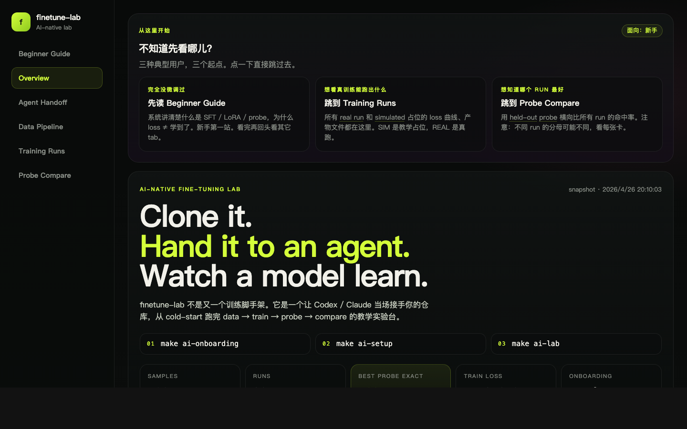
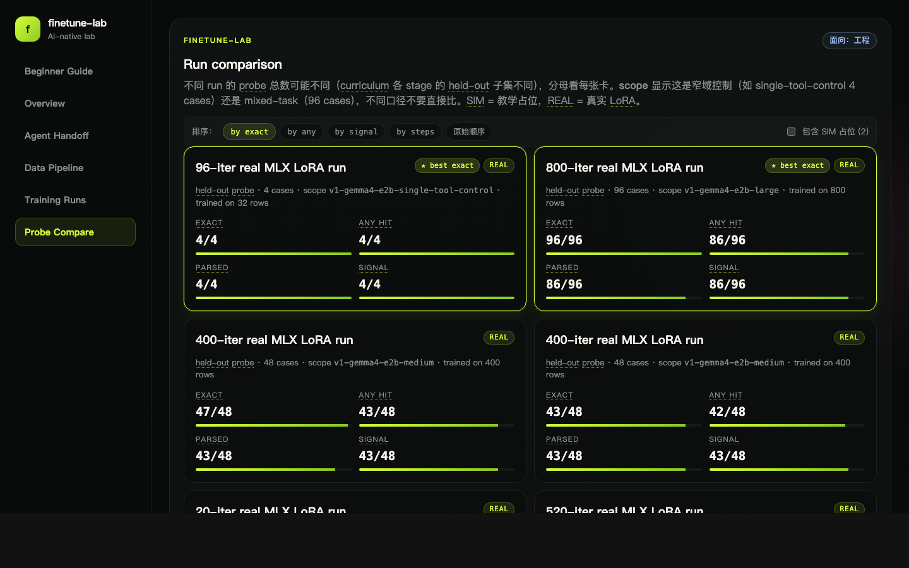
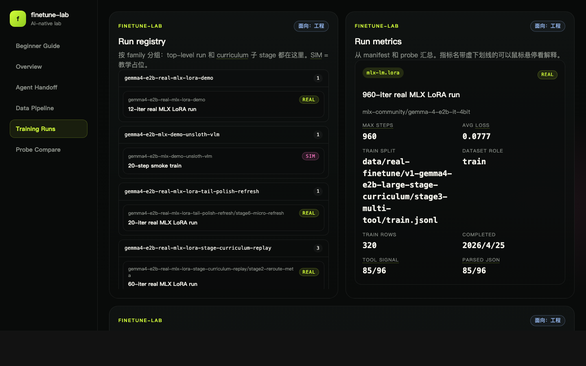

<div align="center">

# finetune-lab

**把 SFT 数据生成 → LoRA 微调 → held-out probe → 可视化对比这条链路**
**收成一个仓库 + 一个交互站点。**

[](https://github.com/xianfeng92/finetune-lab/actions/workflows/pages.yml)
[](https://xianfeng92.github.io/finetune-lab/)
[](https://github.com/ml-explore/mlx)
[](#ai-native交给-codex--claude-接手)

🌐 **在线 demo：** https://xianfeng92.github.io/finetune-lab/

[](https://xianfeng92.github.io/finetune-lab/)

</div>

---

## 这个仓库解决什么

模型微调这个领域的入门资料分两类：要么是只讲概念的 blog（"什么是 LoRA"），要么是只贴脚本的 cookbook（"跑这条命令"）。**夹在中间的"我把 case 跑通了，现在能不能看到模型到底学到了什么"** 几乎没人系统讲。

`finetune-lab` 把这条链路收进一个仓库：

1. **生成 SFT 数据** —— 单工具 / 多工具 / curriculum / preference pairs 都现成
2. **本地真实微调** —— Apple Silicon 上的 `mlx-lm.lora`，几十到几百 step 的真小规模 run
3. **held-out probe** —— 训练完拿独立子集去测，看模型选对工具没、参数对没、行为合不合规
4. **Web 实验台** —— 把上面三步的所有产物（loss 曲线 / probe 命中率 / 失败 case diff）摊在一个浏览器里横向比

整条链路的入口是 `make`：[ai-onboarding](#quick-start--60-秒上手) 探仓库、`ai-setup` 装依赖、`ai-lab` 把最小教学闭环跑一遍。

---

## Highlights

- 🍎 **Apple Silicon 友好** — 默认走 `mlx-lm.lora`，不需要 CUDA / 不需要云
- 🎓 **教学占位 + 真训练双轨** — `simulated` 路径让你不下大模型也能走通流程；`real-*` 路径才真跑
- 🧪 **probe 不复用训练数据** — held-out split 是独立 `held-out.jsonl`，避免"loss 漂亮但 probe 拉胯"被掩盖
- 📊 **Web 实验台** — Beginner Guide / Training Runs / Probe Compare 三个 view，跑完不打开 jupyter 就能比 run
- 🤖 **AI-native** — 仓库自带 `AGENTS.md` + `make ai-onboarding`，一句话就能交给 Claude / Codex 接手
- 📚 **数据集治理** — 23 个数据集都自带 `dataset-card.md` + `redaction-report.md`，PII 扫描产物可看可审

---

## Quick start — 60 秒上手

```bash
git clone https://github.com/xianfeng92/finetune-lab.git
cd finetune-lab

make ai-onboarding   # 探仓库：检查 Python venv / 数据 / 产物准备情况
make ai-setup        # 缺啥补啥：建 venv、装 jsonschema/pytest、npm deps
make ai-lab          # 跑最小教学闭环（data → simulated train → probe → web build）
```

**不想本地跑？** 直接看在线 demo：[xianfeng92.github.io/finetune-lab](https://xianfeng92.github.io/finetune-lab/)

---

## 数据 → 训练 → Probe → 可视化

```
       ┌────────────────┐    ┌────────────────┐    ┌────────────────┐
data → │ data_pipeline  │ →  │ mlx-lm.lora    │ →  │ probe (held-   │
       │ samples.jsonl  │    │ adapter (.safe │    │ out.jsonl)     │
       │ train / held-  │    │ tensors)       │    │ probe-results  │
       │ out split      │    │ train-metrics  │    │ .jsonl         │
       └────────────────┘    └────────────────┘    └────────────────┘
                                                            │
                                                            ▼
                                                   ┌────────────────┐
                                                   │ Web 实验台      │
                                                   │ run/curve/case │
                                                   │ diff visualize │
                                                   └────────────────┘
```

每一步都有 `make` 入口、固定产物路径、对应的解释文档。

| 阶段 | 标准命令 | 关键产物 | 文档 |
|---|---|---|---|
| 数据生成 | `make data-demo` | `data/sft/v1-seed-anchor-demo/{samples,train,held-out}.jsonl` | [training/data_pipeline/README.md](training/data_pipeline/README.md) |
| 真实微调 | `make real-stage-curriculum` | `outputs/gemma4-e2b-real-mlx-lora-*/adapter/` | [docs/ai/gemma4-real-finetune-guide.md](docs/ai/gemma4-real-finetune-guide.md) |
| held-out probe | `make real-probe-mac` | `outputs/.../probe-results.jsonl` | [training/finetune/README.md](training/finetune/README.md) |
| 可视化 | `make web-build` | `web/dist/` (静态 HTML) | [web/README.md](web/README.md) |

---

## 真训练 vs 教学占位

仓库里所有 run 都打了 `SIM` / `REAL` 标签：

- `SIM` — `simulated` 路径，写假 loss / 假 adapter，**不真的更新模型**。给"想看流程，但不想下 26B checkpoint"的人。
- `REAL` — 真的调 `mlx-lm.lora` 跑，会写出真 LoRA adapter（几 MB 到几十 MB 的 `.safetensors`）。

```bash
# 教学占位
make smoke-train-mac       # 20 step simulated
make probe-mac

# 真小规模 LoRA（默认 Gemma 4 E2B-it 4-bit）
make bootstrap-real-finetune
make real-finetune-data
make real-stage-curriculum
make real-probe-mac
```

Web 实验台会同屏列出 SIM 和 REAL run，并默认在 Probe Compare 折叠 SIM 占位，避免误读。

---

## Web 实验台

[在线 demo →](https://xianfeng92.github.io/finetune-lab/) 不用 clone 就能看完整效果。

| Tab | 干什么 |
|---|---|
| **Beginner Guide** | 系统讲清楚 SFT / LoRA / probe / 为什么 loss ≠ "学到了"，自带右侧 TOC |
| **Overview** | Manifesto 速读 + Roadmap + 各 Level 教学包（默认折叠，按需展开） |
| **Agent Handoff** | sense → prepare → teach → compare 的标准交接 timeline |
| **Data Pipeline** | 数据集类目分布、train/held-out split、单条样本解剖、23 个 dataset cards |
| **Training Runs** | 所有 run 的 loss 曲线（带共享 y 轴 toggle）、metric、artifact |
| **Probe Compare** | 多 run 横向对比，★ best exact 高亮，case 级集合 diff（match / extra / missing）|

<table>
  <tr>
    <td><a href="https://xianfeng92.github.io/finetune-lab/#/compare"></a><br/><sub>Probe Compare：4 维排序 + best 标记</sub></td>
    <td><a href="https://xianfeng92.github.io/finetune-lab/#/runs"></a><br/><sub>Training Runs：run registry + loss 曲线</sub></td>
  </tr>
</table>

本地启动方式：

```bash
cd web && npm install && npm run dev   # http://localhost:4173
# 或者
make web-install && make web-build     # 产 web/dist/ 静态 HTML
```

---

## AI-native：交给 Codex / Claude 接手

这是这个仓库和"普通 finetune cookbook"最大的差别。

仓库根目录的 [`AGENTS.md`](AGENTS.md) + [`project-context.json`](project-context.json) 把"该怎么读、该怎么跑"写成了 agent 协议。一句话就能让 agent 接手：

```text
阅读 AGENTS.md、project-context.json、docs/ai/setup.md、docs/ai/workflows.md。
先运行 make ai-onboarding 判断当前状态；如果依赖未准备好先执行 make ai-setup；
然后继续运行 make ai-lab，并在每一步告诉我当前产物、为什么要做这一步、下一步是什么。
```

agent 会在终端里自己讲解链路，不用你查 README 翻命令。

---

## 项目结构

```text
finetune-lab/
├── data/                              # SFT 数据集（含 dataset cards / redaction reports）
│   ├── sft/                              # 主数据集 (small/medium/large)
│   ├── real-finetune/                    # mlx-lm.lora 直接喂的数据
│   ├── public-source/ public-normalized/ # 引用 / 改造过的公开数据集
│   └── preferences/                      # preference pairs
├── training/
│   ├── data_pipeline/                    # 数据生成 + 校验 + governance
│   └── finetune/                         # mlx-lm.lora wrapper / probe runner
├── docs/
│   ├── ai/                               # agent 接手要读的：setup/workflows/beginner-guide
│   ├── specs/ changes/ reviews/          # 设计 / 实现 / review 留档
│   └── assets/                           # README 用的图
├── outputs/                           # 训练产物（gitignore，由 make 生成）
├── web/                               # React + Vite 实验台
└── Makefile                           # 标准入口（make help）
```

---

## 文档地图

按"想做什么"找：

- **想理解整条链路** → [docs/ai/beginner-guide.md](docs/ai/beginner-guide.md)
- **想自己跑真训练** → [docs/ai/gemma4-real-finetune-guide.md](docs/ai/gemma4-real-finetune-guide.md)
- **想搞清楚每步标准命令** → `make help` 或 [docs/ai/workflows.md](docs/ai/workflows.md)
- **想做数据治理** → [docs/specs](docs/specs/) 下的 data-governance spec
- **想给这个仓库加 agent 行为** → [AGENTS.md](AGENTS.md)

---

## Roadmap

当前版本聚焦"教学闭环 + 单机 LoRA + 数据治理"。后续方向：

- [ ] Level 2-4 的训练策略实验包（regularization、scaling laws、curriculum 对照）
- [ ] preference tuning（DPO）真训练通路 —— 当前 Level 6 还是 rubric/dataset 阶段
- [ ] Gemma 4 E4B / 31B 的多 GPU 触发条件 rubric
- [ ] Probe Compare 的多模型并排（不限于同 base）

---

## Contributing

欢迎 PR / issue。建议路线：

1. 先读 `AGENTS.md` 了解仓库协议
2. 设计变更（新 dataset / 新训练策略 / 新 probe 维度）写 spec 到 `docs/specs/<date>-<topic>-spec.md`
3. 实现完成后写 impl 笔记到 `docs/changes/`
4. review 写到 `docs/reviews/`

---

## License

License 待定。当前默认按"内部 / 教学使用"看待，外部分发前请等待 MIT 或 Apache 2.0 公告。
