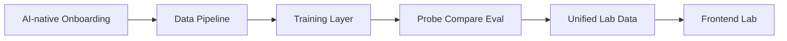
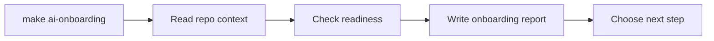
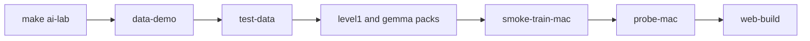
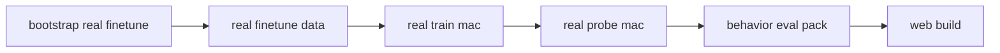

# finetune-lab Architecture And Core Workflows

## 项目一句话

`finetune-lab` 是一个 AI-native 的微调学习实验台。它把一条最小但完整的链路收成：

`onboarding -> data -> train -> probe -> compare -> frontend`

目标不是只让人“跑一个训练命令”，而是让人和 agent 都能看懂：

- 数据是怎么来的
- 微调到底训了什么
- probe 在验证什么
- 不同数据量和训练策略会带来什么差异

## 架构总览



## 模块分层

### 1. Agent / Orchestration 层

这一层的目标是让 Codex / Claude 接手仓库时不用猜命令。

核心入口：

- `Makefile`
- [AGENTS.md](/Users/xforg/AI_SPACE/finetune-lab/AGENTS.md)
- [project-context.json](/Users/xforg/AI_SPACE/finetune-lab/project-context.json)
- [docs/ai/setup.md](/Users/xforg/AI_SPACE/finetune-lab/docs/ai/setup.md)
- [docs/ai/workflows.md](/Users/xforg/AI_SPACE/finetune-lab/docs/ai/workflows.md)
- [scripts/ai_onboarding_report.py](/Users/xforg/AI_SPACE/finetune-lab/scripts/ai_onboarding_report.py)

它负责：

- 判断环境是否 ready
- 告诉 agent 下一步应该跑 setup、数据、训练还是前端
- 把学习路径状态写成 onboarding report
- 给人类和 agent 一个统一的标准入口

常用命令：

- `make ai-onboarding`
- `make ai-setup`
- `make ai-lab`

### 2. Data Pipeline 层

这一层负责把“车控工具调用学习任务”写成结构化训练数据。

核心目录：

- [training/data_pipeline](/Users/xforg/AI_SPACE/finetune-lab/training/data_pipeline)
- [data/sft](/Users/xforg/AI_SPACE/finetune-lab/data/sft)

核心职责：

- 生成 SFT 样本
- 切分 `train.jsonl` / `held-out.jsonl`
- 对样本做 schema 校验
- 输出数据总结和 validation report

当前样本已经显式带：

- `category`
- `behavior`
- `risk`
- `vehicle_state`
- `expected_system_action`

这意味着它不再只是“工具调用样本”，而是在往更真实的车机行为决策样本升级。

代表产物：

- [data/sft/v1-seed-anchor-demo/samples.jsonl](/Users/xforg/AI_SPACE/finetune-lab/data/sft/v1-seed-anchor-demo/samples.jsonl:1)
- [data/sft/v1-seed-anchor-demo/train.jsonl](/Users/xforg/AI_SPACE/finetune-lab/data/sft/v1-seed-anchor-demo/train.jsonl:1)
- [data/sft/v1-seed-anchor-demo/held-out.jsonl](/Users/xforg/AI_SPACE/finetune-lab/data/sft/v1-seed-anchor-demo/held-out.jsonl:1)
- [data/sft/v1-gemma4-e2b-medium/dataset_summary.json](/Users/xforg/AI_SPACE/finetune-lab/data/sft/v1-gemma4-e2b-medium/dataset_summary.json:1)

### 3. Training 层

这一层分成两条路径：

- 教学用 simulated smoke train
- Apple Silicon 上的真实 MLX LoRA mini fine-tune

核心目录：

- [training/finetune](/Users/xforg/AI_SPACE/finetune-lab/training/finetune)

#### 3.1 Simulated 路径

作用：

- 给学习者展示 run manifest、loss curve、probe 的基本形态
- 用很低成本跑通“训练后会产生什么产物”

特点：

- 快
- 适合教学
- 不是严格意义上的真实 optimizer 更新

核心命令：

- `make smoke-train-mac`
- `make smoke-train-mac-100`

代表产物：

- [outputs/gemma4-e2b-mlx-demo-unsloth-vlm/run-manifest.json](/Users/xforg/AI_SPACE/finetune-lab/outputs/gemma4-e2b-mlx-demo-unsloth-vlm/run-manifest.json:1)

#### 3.2 Real MLX LoRA 路径

作用：

- 在 Apple Silicon 上对 `mlx-community/gemma-4-e2b-it-4bit` 做真实 LoRA 更新
- 让项目从“教学实验台”变成“可执行的小规模真实微调仓库”

特点：

- 真实训练
- 真实 adapter
- 真实 probe
- 已支持 small / medium 数据量和多种训练策略

核心命令：

- `make bootstrap-real-finetune`
- `make real-finetune-data`
- `make real-train-mac`
- `make real-probe-mac`

代表产物：

- [data/real-finetune/v1-gemma4-e2b-toolcall-demo/train.jsonl](/Users/xforg/AI_SPACE/finetune-lab/data/real-finetune/v1-gemma4-e2b-toolcall-demo/train.jsonl:1)
- [outputs/gemma4-e2b-real-mlx-lora-demo/run-manifest.json](/Users/xforg/AI_SPACE/finetune-lab/outputs/gemma4-e2b-real-mlx-lora-demo/run-manifest.json:1)

### 4. Probe / Compare / Eval 层

这一层是项目的教学核心，因为它回答的是：

“模型到底学会了什么？”

主要分成 4 类结果：

- 基础 probe
- run compare
- behavior eval
- teaching packs

#### 基础 probe

作用：

- 对 held-out / test split 做结构化工具调用评测
- 看 `exact_name_match`、`structured_output_valid`、`arguments_match`

#### run compare

作用：

- 比较不同 step、不同数据量、不同训练策略
- 让用户看到“更多数据”和“更好的 curriculum”不是同一件事

#### behavior eval

作用：

- 单独看 `behavior_accuracy`
- 单独看 `unsafe_direct_call_rate`
- 看 `confirm / reject` contract 是否命中

#### teaching packs

项目已经把很多概念做成了 pack，供前端直接读：

- Level 1 baseline pack
- Gemma track pack
- Level 5 tool-routing / structured-output pack
- Level 6 preference / scale-up pack
- data-scale compare pack

代表产物：

- [outputs/behavior/behavior-eval-pack.json](/Users/xforg/AI_SPACE/finetune-lab/outputs/behavior/behavior-eval-pack.json:1)
- [outputs/compare/data-scale-compare-pack.json](/Users/xforg/AI_SPACE/finetune-lab/outputs/compare/data-scale-compare-pack.json:1)
- [outputs/level5/tool-routing-dataset-pack.json](/Users/xforg/AI_SPACE/finetune-lab/outputs/level5/tool-routing-dataset-pack.json:1)
- [outputs/level6/gemma-scale-up-compare.json](/Users/xforg/AI_SPACE/finetune-lab/outputs/level6/gemma-scale-up-compare.json:1)

### 5. Unified Data + Frontend 层

这一层负责把散落在 `data/`、`outputs/` 里的训练与评测产物汇总成前端统一数据层。

核心文件：

- [web/scripts/build-lab-data.mjs](/Users/xforg/AI_SPACE/finetune-lab/web/scripts/build-lab-data.mjs:1)
- [web/src/data-layer.ts](/Users/xforg/AI_SPACE/finetune-lab/web/src/data-layer.ts:1)
- [web/src/App.tsx](/Users/xforg/AI_SPACE/finetune-lab/web/src/App.tsx:1)
- [web/scripts/export-standalone-html.mjs](/Users/xforg/AI_SPACE/finetune-lab/web/scripts/export-standalone-html.mjs:1)

它负责：

- 汇总 `project-context + dataset + runs + packs`
- 给 React 前端提供统一 schema
- 给 IAB 单文件静态页导出可直接 `file://` 打开的版本

前端当前主要展示：

- AI onboarding
- Level 1 baseline
- Gemma 4 六阶段路线图
- Data pipeline
- Training runs
- Probe compare
- Behavior eval pack
- Data scale vs training strategy
- Level 5 / Level 6 teaching blocks

## 核心流程

## 流程 1：AI-native Onboarding



适合：

- 第一次接手仓库
- 让 agent 判断现在该 setup 还是该直接跑实验

## 流程 2：最小教学闭环



适合：

- 快速理解仓库结构
- 看最小微调教学闭环
- 不立即依赖真实模型训练

## 流程 3：真实 Gemma 4 微调闭环



适合：

- 看真实 LoRA 更新
- 看真实 adapter 和真实 probe
- 做 small / medium 数据量实验

## 流程 4：数据量与训练策略对比

当前项目已经把“数据量”和“训练策略”的对比做成了标准实验路径。

可直接跑：

- `make real-small-direct-compare`
- `make real-medium-direct-compare`
- `make real-medium-stage-curriculum-consolidation`
- `make data-scale-compare-pack`

这条链要回答的问题是：

- small 和 medium 在同一 schema 下差多少
- direct mixed 和 curriculum + consolidation 差多少
- 更多数据和更好的训练策略哪个更关键

## 当前最关键的 4 条标准路径

### 路径 A：先了解仓库

```bash
make ai-onboarding
make ai-lab
```

### 路径 B：先看数据

```bash
make data-demo
make test-data
```

### 路径 C：跑真实 Gemma 4 mini fine-tune

```bash
make bootstrap-real-finetune
make real-finetune-data
make real-train-mac
make real-probe-mac
```

### 路径 D：看规模和策略差异

```bash
make data-medium
make real-finetune-data-medium
make real-medium-direct-compare
make real-medium-stage-curriculum-consolidation
make data-scale-compare-pack
```

## 当前项目最重要的设计取舍

### 1. 先保证最小闭环，再逐步上真实复杂度

所以项目同时保留：

- simulated 路径
- real MLX LoRA 路径

这是为了让学习和实验都能成立。

### 2. 先讲行为，再讲 loss

所以项目一直强调：

- held-out probe
- behavior eval
- compare packs

而不是只盯训练曲线。

### 3. 先做统一数据层，再做前端

所以前端不是直接读某一个 run，而是统一读 `lab-data.json` 对应的汇总结果。

### 4. 先让 agent 能接手，再谈用户体验

所以项目大量工作都放在：

- `Makefile` 标准入口
- onboarding report
- project context
- docs/ai/* 协议

## 当前你最值得先看的文件

如果你想用 10 分钟理解这个仓库，建议按这个顺序看：

1. [README.md](/Users/xforg/AI_SPACE/finetune-lab/README.md)
2. [project-context.json](/Users/xforg/AI_SPACE/finetune-lab/project-context.json)
3. [docs/ai/workflows.md](/Users/xforg/AI_SPACE/finetune-lab/docs/ai/workflows.md)
4. [training/data_pipeline/README.md](/Users/xforg/AI_SPACE/finetune-lab/training/data_pipeline/README.md)
5. [training/finetune/README.md](/Users/xforg/AI_SPACE/finetune-lab/training/finetune/README.md)
6. [docs/ai/gemma4-real-finetune-guide.md](/Users/xforg/AI_SPACE/finetune-lab/docs/ai/gemma4-real-finetune-guide.md)

## 一句话总结

`finetune-lab` 现在不是单纯的训练脚手架，而是一个把数据生成、教学 smoke run、真实 Gemma 4 LoRA、probe、behavior eval、规模对比和前端可视化收成统一闭环的 AI-native 微调学习实验台。
