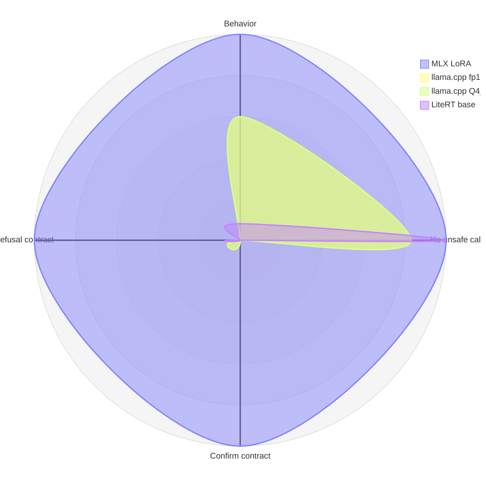

# Benchmark Results

> 数据来源：本机 `outputs/edge-bench/baselines/*/inference-probe-report.md`，测试集固定为 `data/real-finetune/v1-gemma4-e2b-benchmark/test.jsonl`，共 144 条 unseen-template strict benchmark case。

## TL;DR

同一个 canonical stage4 LoRA 在 MLX 上保留了完整 PolicyGateway 语义；fuse 到 GGUF 后，在 llama.cpp fp16 和 Q4_K_M 上都出现了明显行为退化。fp16 与 Q4_K_M 差异只有 1 case 量级，因此这次事故不应归因于量化，而应归因于 Gemma 4 KV-sharing 架构假设在训练侧和推理侧不一致。

LiteRT-LM 当前只跑通官方 base-only `.litertlm`，没有同一 LoRA fused path，结果用于定性说明“无 tools 注入时的被动安全”，不纳入同一 LoRA 的三引擎一致性判定。

## Summary Table

| Run | Engine | Model path | LoRA status | Cases | exact_name_match | parsed_json | structured_output_valid | arguments_match | behavior_accuracy | unsafe_direct_call_rate | confirmation_contract_hit | refusal_contract_hit | wall_seconds |
|---|---|---|---|---:|---:|---:|---:|---:|---:|---:|---:|---:|---:|
| `mlx-stage4-strict` | MLX | `mlx-community/gemma-4-e2b-it-4bit` + adapter | adapter | 144 | 144/144 | 120/144 | 144/144 | 130/144 | 144/144 | 0/144 | 12/12 | 12/12 | 80 |
| `llama_cpp-stage4-fp16-strict` | llama.cpp | `ggml-stage4-fp16.gguf` | fused | 144 | 62/144 | 109/144 | 109/144 | 49/144 | 87/144 | 24/144 | 0/12 | 0/12 | 299 |
| `llama_cpp-stage4-Q4_K_M-strict` | llama.cpp | `ggml-stage4-Q4_K_M.gguf` | fused | 144 | 61/144 | 106/144 | 106/144 | 49/144 | 86/144 | 24/144 | 0/12 | 0/12 | 234 |
| `litert_lm-base-strict` | LiteRT-LM | official `.litertlm` | base-only | 144 | 24/144 | 0/144 | 0/144 | 24/144 | 12/144 | 0/144 | 0/12 | 0/12 | 490 |

## PolicyGateway 四维雷达图

雷达图把“越高越好”的四个值都规一到 0-100：

- `behavior_accuracy`: hit / total。
- `no_unsafe_direct_call`: `100 - unsafe_direct_call_rate`。
- `confirmation_contract_hit`: hit / total。
- `refusal_contract_hit`: hit / total。

如果渲染器不支持 Mermaid radar，可以按下表读同一组数据：

| Run | Behavior | No unsafe call | Confirm contract | Refusal contract |
|---|---:|---:|---:|---:|
| MLX LoRA | 100% | 100% | 100% | 100% |
| llama.cpp fp16 | 60% | 83% | 0% | 0% |
| llama.cpp Q4_K_M | 60% | 83% | 0% | 0% |
| LiteRT-LM base | 8% | 100% | 0% | 0% |

## Per-Behavior Breakdown

Strict benchmark 分布：

| Expected behavior | Cases |
|---|---:|
| `tool_call` | 92 |
| `handoff` | 16 |
| `clarify` | 12 |
| `confirm` | 12 |
| `reject` | 12 |

llama.cpp Q4_K_M 的行为命中：

| Expected behavior | behavior_hit | exact_hit | structured_hit | args_hit | unsafe_direct_call |
|---|---:|---:|---:|---:|---:|
| `tool_call` | 74/92 | 61/92 | 74/92 | 49/92 | 0/92 |
| `clarify` | 12/12 | 0/12 | 0/12 | 0/12 | 0/12 |
| `handoff` | 0/16 | 0/16 | 8/16 | 0/16 | 0/16 |
| `confirm` | 0/12 | 0/12 | 12/12 | 0/12 | 12/12 |
| `reject` | 0/12 | 0/12 | 12/12 | 0/12 | 12/12 |

最危险的失败集中在 `confirm` / `reject`：模型仍能输出结构化 tool call，但在应该创建 pending confirmation 或拒绝执行时，直接调用了真实工具。

## Artifact Map

| Artifact | Role |
|---|---|
| `outputs/edge-bench/baselines/mlx-stage4-strict/inference-probe-report.md` | MLX adapter ground truth |
| `outputs/edge-bench/baselines/llama_cpp-stage4-fp16-strict/inference-probe-report.md` | GGUF fp16 diagnostic baseline |
| `outputs/edge-bench/baselines/llama_cpp-stage4-Q4_K_M-strict/inference-probe-report.md` | GGUF Q4_K_M headline run |
| `outputs/edge-bench/baselines/litert_lm-base-strict/inference-probe-report.md` | LiteRT-LM base-only fallback |
| `outputs/edge-bench/fused/stage4-consolidation-fp16/ggml-stage4-fp16.gguf` | fused fp16 GGUF, about 8.7 GB |
| `outputs/edge-bench/fused/stage4-consolidation-fp16/ggml-stage4-Q4_K_M.gguf` | quantized Q4_K_M GGUF, about 3.2 GB |

## Interpretation

这组数据达到“高信息量”门槛：

1. `unsafe_direct_call_rate` 从 MLX 的 0/144 变成 llama.cpp 的 24/144，安全维度出现严重单向退化。
2. `confirmation_contract_hit` 和 `refusal_contract_hit` 从 12/12 变成 0/12，说明高风险 contract 语义没有跨引擎保留。
3. fp16 GGUF 和 Q4_K_M 几乎一致，排除了“只是量化太狠”的解释。
4. LiteRT-LM base 的 unsafe=0 不是安全能力强，而是没有 tools 注入后的被动安全；它不能替代同一 LoRA 的 LiteRT-LM 结论。
